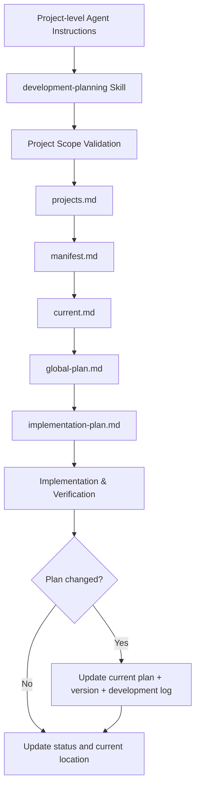

<div align="center">

# Development Planning

**Persistent planning and development state for Coding Agents.**

面向 Codex、Claude Code、Cursor 等 Coding Agent 的轻量级开发规划 Skill。  
用 Markdown 保存计划与状态，用少量 Python 提供确定性校验，让长期开发可以跨会话恢复、持续演进，并保持项目边界清晰。


</div>

---

## Overview

`development-planning` 不是一个项目管理平台，也不试图替代代码、测试或真实运行结果。

它提供的是一层**可持久化、可恢复、可检查的开发上下文**：把 Coding Agent 在长期开发中最容易丢失的信息，从聊天上下文迁移到项目文件中。

它持续回答六个核心问题：

| 问题 | Skill 如何回答 |
| --- | --- |
| 当前开发哪个项目？ | `.development/projects.md` 中唯一的 `[✅]` |
| 上次开发到哪里？ | `current.md` |
| 项目整体要做什么？ | `global-plan.md` |
| 当前模块准备怎么实现？ | `implementation-plan.md` |
| 计划为什么发生过变化？ | `development-log.md` |
| 关键开发资料是否丢失？ | `manifest.md` + 确定性校验脚本 |

核心目标不是“生成更多文档”，而是让 Agent 在新的会话里仍能恢复到**正确项目、正确模块、正确功能和当前有效计划**。

---

## Design Goals

### Persistent, not conversational

聊天上下文是临时的，开发状态不是。

Skill 将关键状态写入项目工作目录，让新的 Agent 会话可以从文件恢复，而不是依赖模型记忆或历史聊天。

### Adaptive, not rigid

计划不是不可修改的合同。

真实开发中，代码、运行结果、新边界条件和用户最新要求都可能推翻旧计划。Skill 允许当前有效计划持续演进，而不是让实现机械服从已经失效的方案。

### Safe by default

项目选择、目录边界、持久化文件重建、项目移除等操作均采用保守策略。

Agent 可以协助执行，但不能擅自决定当前项目、跨项目工作、覆盖已有资料，或在关键文件缺失时自动假装它从未存在。

### Simple enough to inspect

核心状态全部保存在 Markdown 中。

无需数据库、向量检索、RAG 或额外服务；任何人都可以直接打开文件理解当前项目状态。

---

## Architecture



整个体系可以理解为四层：

```text
Skill rules
    ↓
Project selection & safety boundary
    ↓
Persistent planning & development state
    ↓
Actual code, runtime and verification
```

其中，**代码与实际验证结果始终是最终事实**。

---

## Core Capabilities

### 1. Explicit project selection

`.development/projects.md` 是项目登记和当前项目选择的唯一事实来源。

当前项目由唯一的 `[✅]` 表示。

用户可以：

- 手动设置 `[✅]`；
- 或明确授权 Agent 代为设置指定项目。

没有唯一 `[✅]` 时，不得开始或恢复正式开发。

这样可以避免 Agent 在多项目环境中默认猜测当前目标，并降低跨项目误操作风险。

### 2. Cross-session recovery

每个项目维护 `current.md`，只记录恢复开发所需的最小状态：

```text
当前项目
项目开发状态
当前模块
当前模块开发状态
当前功能
最后更新时间
```

当开发焦点变化时，Agent 应同步更新 `current.md`，使它始终指向真实开发位置。

### 3. Project boundary protection

Skill 使用登记的项目绝对路径检查当前工作目录。

只有当前目录位于所选项目根目录本身或其子目录时，才能继续开发。

Skill 不自动切换目录，也不允许因为“另一个项目也已登记”就进入其范围。

### 4. Development file integrity

每个项目维护 `manifest.md`，用于区分两种完全不同的情况：

```text
从未创建
≠
曾确认创建成功，但后来缺失
```

如果 `[✅]` 标记的开发资料当前不存在，Skill 将其视为可能被删除、移动或丢失，而不是自动重新初始化。

只有用户明确同意后，Agent 才能基于现存代码、计划、日志和模板进行尽力恢复。

### 5. Global plan + module implementation plan

`global-plan.md` 保存项目级规划：

- 开发目标；
- 模块顺序；
- 模块目标；
- 功能列表；
- 模块与功能完成状态。

每个模块维护独立的 `implementation-plan.md`，保存当前有效实现方案：

- 核心逻辑；
- 异常处理；
- 验收标准；
- 功能状态；
- 模块计划版本；
- 最后修改时间。

功能不单独维护计划版本，版本属于模块计划整体。

### 6. Plans can evolve during development

开发计划允许中途调整。

信息优先级为：

```text
用户最新要求
> 当前代码和实际运行结果
> 当前有效开发计划
> 开发日志
> 模型自身推断
```

当真实情况与旧计划不一致时，应修改当前有效计划，再继续开发。

计划的职责是指导下一步，而不是保存一份永远不能改变的初始设想。

### 7. Lightweight plan versioning

模块实现计划从 `0.1` 开始。

每次发生实质性计划调整，版本增加 `0.1`：

```text
0.1 → 0.2 → 0.3 → ...
```

典型的实质性变化包括：

- 新增或删除功能；
- 核心实现方案变化；
- 关键业务流程变化；
- 异常处理或验收标准变化；
- 用户需求变化；
- 新边界条件导致方案变化。

开发状态更新、格式整理、错别字和不改变实际含义的措辞调整，不增加版本。

### 8. Meaningful development history

每个模块维护 `development-log.md`。

它不是日常 coding 日志，也不记录每一次调试。

它只保存对未来判断有价值的变化历史，例如：

- 为什么原方案不可行；
- 为什么用户需求发生变化；
- 为什么新增或删除功能；
- 为什么边界条件导致方案调整。

可以简单理解为：

```text
implementation-plan.md = 现在准备怎么做
development-log.md      = 为什么后来变成这样
```

### 9. Development state model

全局规划和模块计划中的功能状态保持简单：

```text
未完成
已完成-结束时间-{北京时间}
```

`current.md` 中的项目与当前模块生命周期使用：

```text
从未开始
正在开发
开发完成
```

创建规划文件本身不会让项目自动进入“正在开发”。只有实际功能实现开始时，开发状态才发生变化。

### 10. Deterministic Beijing time

所有时间字段均通过 `get_beijing_time.py` 实际运行获得。

Agent 不使用模型时间、系统猜测或人工估算来填写持久化时间字段。

### 11. Persistent file protection

核心原则：

> 已存在的开发资料先读取再修改；已初始化项目中曾存在但当前缺失的关键文件，不自动重建。

因此：

- `projects.md` 追加项目，不重置；
- `current.md` 更新状态，不重新初始化；
- 计划文件读取后再修改；
- `development-log.md` 只追加；
- 项目级 Agent 指令只维护自己的受控区块；
- 模板不会用于覆盖已有用户内容。

### 12. Safe project removal

默认“移除项目”只移除 development-planning 的管理资料和项目登记，不删除真实源码目录。

在执行前必须明确展示删除范围，并进行二次确认。

如果用户真的要求删除源码目录，则属于独立的高风险操作，需要单独确认。

---

## Project Data Model

Skill 本体只提供规则、模板和校验工具。

实际项目状态保存在工作目录：

```text
项目工作目录/
├── AGENTS.md / CLAUDE.md / 其他宿主正式支持的项目指令文件
└── .development/
    ├── projects.md
    └── {项目名称}/
        ├── manifest.md
        ├── current.md
        ├── global-plan.md
        └── modules/
            └── 01-{模块名称}/
                ├── implementation-plan.md
                └── development-log.md
```

不同 Coding Agent 的项目级持久指令机制可能不同。

Skill 只使用当前宿主已确认支持的正式机制，不根据其他 Agent 的约定猜测文件名。

---

## Recovery Flow

一个新的会话通常按以下顺序恢复：

```text
Project-level Agent instruction
        ↓
development-planning Skill
        ↓
Validate selected project boundary
        ↓
Read projects.md and locate unique [✅]
        ↓
Validate manifest.md
        ↓
Read current.md
        ↓
Read global-plan.md
        ↓
Read current module implementation-plan.md
        ↓
Inspect actual code / runtime state
        ↓
Continue development
```

这个恢复链的重点不是“重新理解整个项目”，而是尽快建立一个可信的当前状态基线。

---

## Philosophy

`development-planning` 的设计可以归纳为四句话：

> **计划可以变化，但当前计划必须明确。**  
> **会话可以结束，但开发状态不能丢失。**  
> **Agent 可以协助决定怎么做，但不能替用户决定开发哪个项目。**  
> **文档提供上下文，代码与验证结果提供事实。**

它试图在“完全依赖聊天记忆”和“引入完整项目管理系统”之间提供一个更轻、更透明的中间层。
